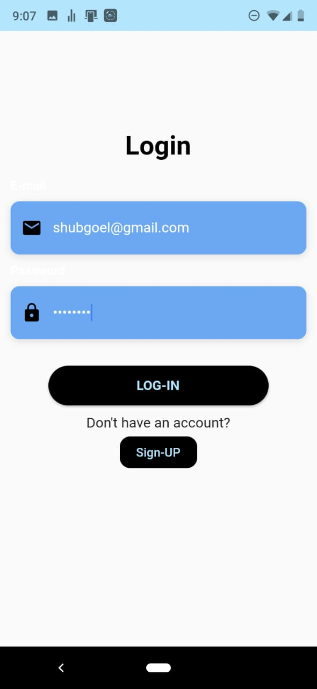
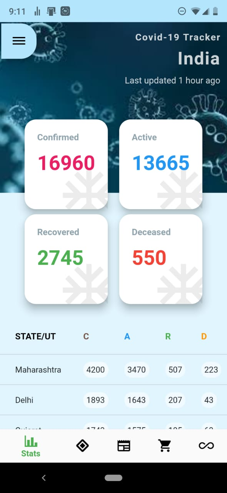
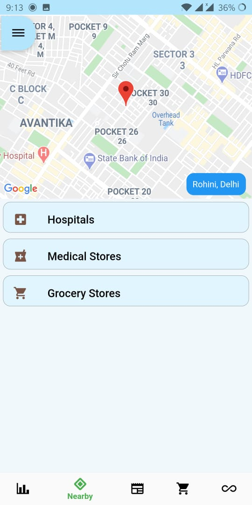
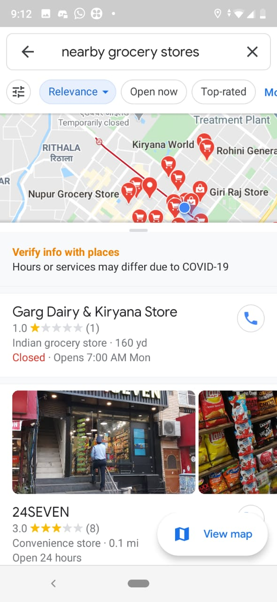
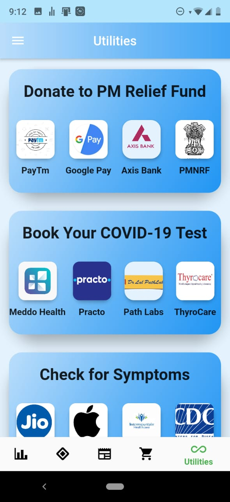
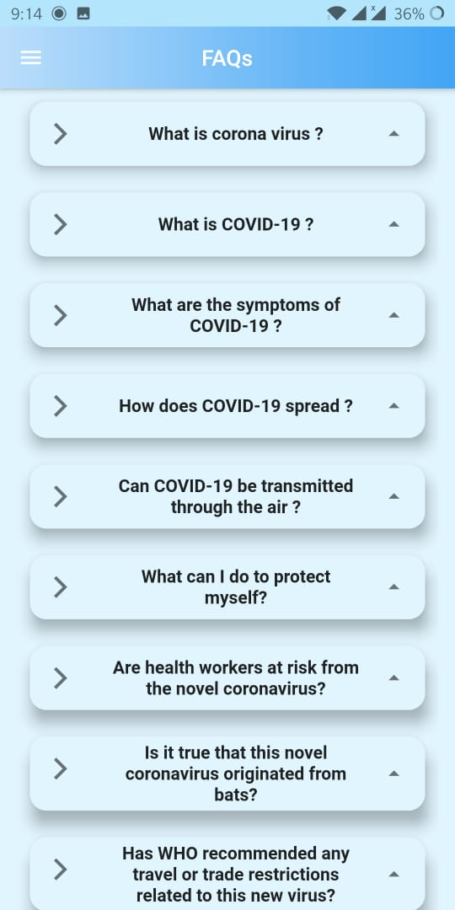

# COVID COMPANION APP

In the current scenario, there is a lot of confusion among people related COVID-19 such as fake news, symptoms, precaution measures, etc. And in the quarantine stage, people are locked in their house and they need medical and food essentials but they can't go outside and some time situation is worse, they feel depressed of being lockdown in the houses. So, taking an account of such a serious problem i made an Andriod App- COVID Companion, which is your all in one app in such a difficult time. The app has the following features:-

1. Live Stats of COVID-19 cases state-wise: Helps in better understanding the data
2. Live News regarding COVID-19: It removes all the fake news and gives accurate and precise info.
3.  Info about COVID-19 such as FAQs, Myth Busters, Precautions.
4. List of all COVID-19 hospitals and helpline numbers state-wise.
5. Donate option for PM Care Fund which has 4 options to donate through Paytm, GooglePay, SBI Online, Axis Bank Online.
So, user can donate authentically without any fraud and using any medium for donations. 
6. Online appointment booking for COVID-19 Test at home.
7. Online shopping options for Disinfectant, Mask, Sanitizers, etc. So, the user doesn't need to go outside.
8. Showing Nearby Hospitals and Medical Stores in case of emergencies.  And also Nearby Grocery Store to buy some food and daily essentials.
9. Live symptoms checker so you can know about your health and can take necessary steps according to it.
 10. Some people get bored and depressed during quarantine and have sometimes suicidal thoughts so a section which will have some of the best cheerful games which they can play with family and friends and get distracted and enjoy the quarantine period.

youtube_link: https://www.youtube.com/watch?v=IXY5_BKdIng&t=3s

Screeenshots: 

&nbsp;
&nbsp;
&nbsp;

&nbsp;]
&nbsp;
&nbsp;

&nbsp;

